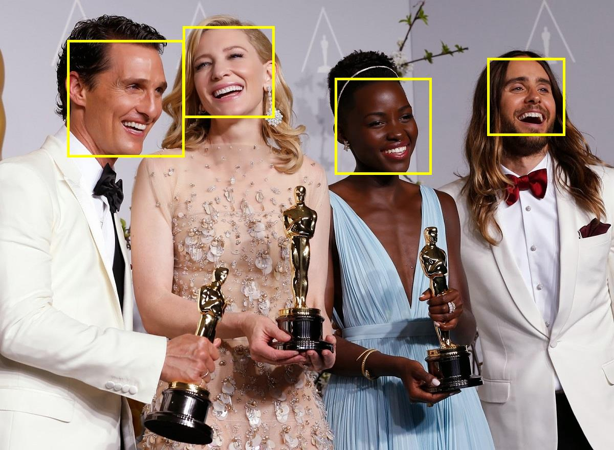
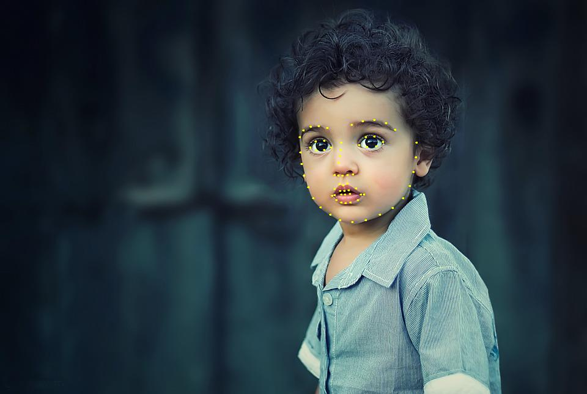
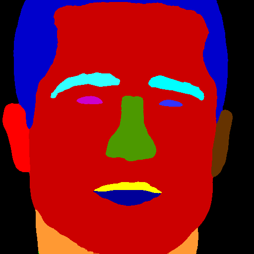
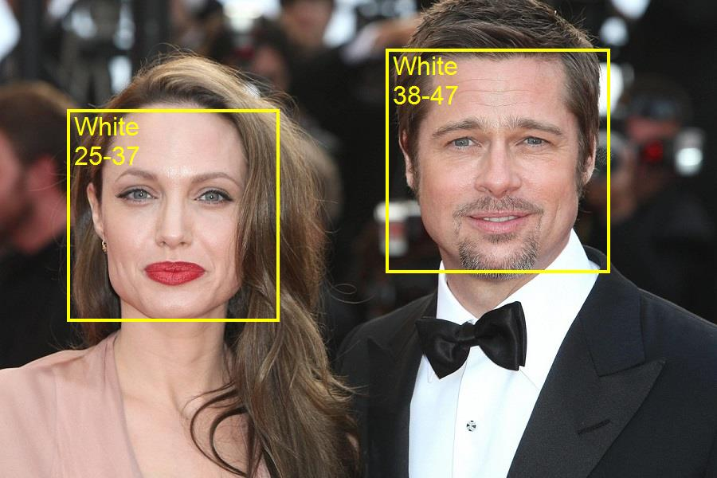

<p align="center"></p>
<p align="center"> Face analytics library based on deep neural networks and <b>ONNX</b> runtime </p>  

# Face detection
Build and run [**FaceDetection.csproj**](FaceDetection) to produce face detection results.
```batch
Image: [oscar.jpg] --> detected [13] faces
Image: [oscar2.jpg] --> detected [4] faces
Image: [selfie.jpg] --> detected [5] faces
Image: [selfie2.jpg] --> detected [18] faces
```

<p align="center"></p>
<p align="center"><b>Figure 1.</b> Results for <i>oscar2.jpg</i></p>  

# Face embeddings classification
Build and run [**FaceEmbeddingsClassification.csproj**](FaceEmbeddingsClassification) to classify faces as "Brad Pitt", "Nicole Kidman" or "Sarah Paulson".
```batch
Image: [brad_1.jpg] --> classified as [Brad Pitt] with similarity [0,96517545]
Image: [brad_2.jpg] --> classified as [Brad Pitt] with similarity [0,8623285]
Image: [brad_3.jpg] --> classified as [Brad Pitt] with similarity [0,8151555]
Image: [nicole_1.jpg] --> classified as [Nicole Kidman] with similarity [0,8584538]
Image: [nicole_2.jpg] --> classified as [Nicole Kidman] with similarity [0,8298364]
Image: [nicole_3.jpg] --> classified as [Nicole Kidman] with similarity [0,8977611]
Image: [sarah_1.jpg] --> classified as [Sarah Paulson] with similarity [0,9042954]
Image: [sarah_2.jpg] --> classified as [Sarah Paulson] with similarity [0,8464778]
Image: [sarah_3.jpg] --> classified as [Sarah Paulson] with similarity [0,84192747]
```

# Face landmarks extraction
Build and run [**FaceLandmarksExtraction.csproj**](FaceLandmarksExtraction) to produce faces landmarks.
```batch
Image: [bruce.jpg] --> detected [1] faces
Image: [jake.jpg] --> detected [1] faces
Image: [kid.jpg] --> detected [1] faces
```
<p align="center"></p>
<p align="center"><b>Figure 2.</b> Results for <i>kid.jpg</i></p>  

# Face semantic segmentation
Build and run [**FaceSemanticSegmentation.csproj**](FaceSemanticSegmentation) to produce faces segmentation maps.
```batch
Image: [brad.jpg] --> detected [1] faces
Image: [michael.jpg] --> detected [1] faces
Image: [nicole.jpg] --> detected [1] faces
```
<p align="center"></p>
<p align="center"><b>Figure 3.</b> Original image <i>brad.jpg</i> and its face segmentation map</p>  

# Gender classification
Build and run [**GenderClassification.csproj**](GenderClassification) to classify faces as "Male" or "Female".
```batch
Image: [CF600.jpg] --> detected [1] faces
        [Face #1]: --> classified as [Female] gender with probability [1]
Image: [CF601.jpg] --> detected [1] faces
        [Face #1]: --> classified as [Female] gender with probability [1]
Image: [CF602.jpg] --> detected [1] faces
        [Face #1]: --> classified as [Female] gender with probability [1]
Image: [CF603.jpg] --> detected [1] faces
        [Face #1]: --> classified as [Female] gender with probability [0,99999154]
Image: [CF604.jpg] --> detected [1] faces
        [Face #1]: --> classified as [Female] gender with probability [0,9968484]
Image: [CM722.jpg] --> detected [1] faces
        [Face #1]: --> classified as [Male] gender with probability [1]
Image: [CM725.jpg] --> detected [1] faces
        [Face #1]: --> classified as [Male] gender with probability [1]
Image: [CM726.jpg] --> detected [1] faces
        [Face #1]: --> classified as [Male] gender with probability [0,9999999]
Image: [CM739.jpg] --> detected [1] faces
        [Face #1]: --> classified as [Male] gender with probability [1]
Image: [CM742.jpg] --> detected [1] faces
        [Face #1]: --> classified as [Male] gender with probability [1]
```

# Race and age classification
Build and run [**RaceAndAgeClassification.csproj**](RaceAndAgeClassification) to classify faces by race and age.
```batch
Image: [baby.jpg] --> detected [1] faces
        [Face #1]: --> classified as [White] race and [<2] age
Image: [bruce.jpg] --> detected [1] faces
        [Face #1]: --> classified as [Asian] race and [25-37] age
Image: [jolie_brad.jpg] --> detected [2] faces
        [Face #1]: --> classified as [White] race and [25-37] age
        [Face #2]: --> classified as [White] race and [38-47] age
Image: [kid.jpg] --> detected [1] faces
        [Face #1]: --> classified as [White] race and [3-7] age
Image: [morgan.jpg] --> detected [1] faces
        [Face #1]: --> classified as [Black] race and [>60] age
```
<p align="center"></p>
<p align="center"><b>Figure 4.</b> Results for <i>jolie_brad.jpg</i></p>  

# Emotion & beauty estimation
Build and run [**EmotionAndBeautyEstimation.csproj**](EmotionAndBeautyEstimation) to classify face emotion and estimate face beauty. 
```batch
Image: [CF600.jpg] --> detected [1] faces
        [Face #1]: --> classified as [happiness] emotion and [8,3/10.0] beauty
Image: [CF601.jpg] --> detected [1] faces
        [Face #1]: --> classified as [happiness] emotion and [6,6/10.0] beauty
Image: [CF602.jpg] --> detected [1] faces
        [Face #1]: --> classified as [neutral] emotion and [8,2/10.0] beauty
Image: [CF603.jpg] --> detected [1] faces
        [Face #1]: --> classified as [happiness] emotion and [7,9/10.0] beauty
Image: [CF604.jpg] --> detected [1] faces
        [Face #1]: --> classified as [neutral] emotion and [7,3/10.0] beauty
Image: [CM722.jpg] --> detected [1] faces
        [Face #1]: --> classified as [neutral] emotion and [8,9/10.0] beauty
Image: [CM725.jpg] --> detected [1] faces
        [Face #1]: --> classified as [neutral] emotion and [5,8/10.0] beauty
Image: [CM726.jpg] --> detected [1] faces
        [Face #1]: --> classified as [neutral] emotion and [6,3/10.0] beauty
Image: [CM739.jpg] --> detected [1] faces
        [Face #1]: --> classified as [happiness] emotion and [7,5/10.0] beauty
Image: [CM742.jpg] --> detected [1] faces
        [Face #1]: --> classified as [neutral] emotion and [8/10.0] beauty
```

# GPU Perfomance tests
Build and run [**GPUPerfomanceTests.csproj**](GPUPerfomanceTests) to test FaceONNX inference on GPU.  
GPU Perfomance tests with CUDA 10.2 and cuDNN 8.0.3 on NVIDIA GeForce GTX 1050 Ti.
```
FPS test for [FaceONNX.FaceDetector]
Initializing GPU device [0]
Finished in [1657] mls.
Running FPS test for [1000] iterations
FPS --> [16,14961]

FPS test for [FaceONNX.FaceDetectorLight]
Initializing GPU device [0]
Finished in [656] mls.
Running FPS test for [1000] iterations
FPS --> [36,65555]
```
