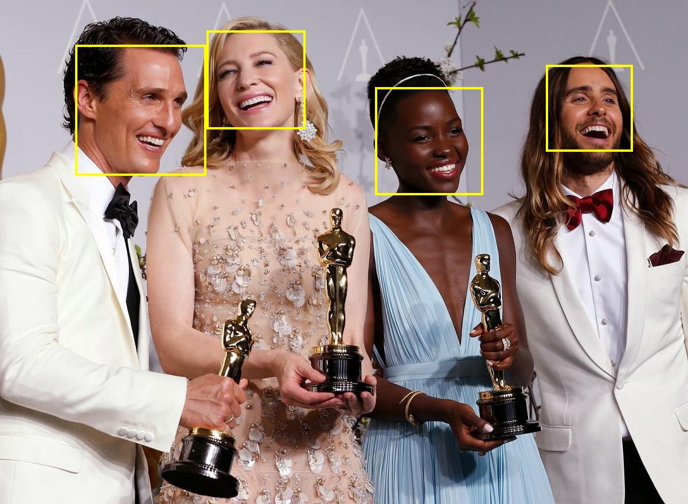
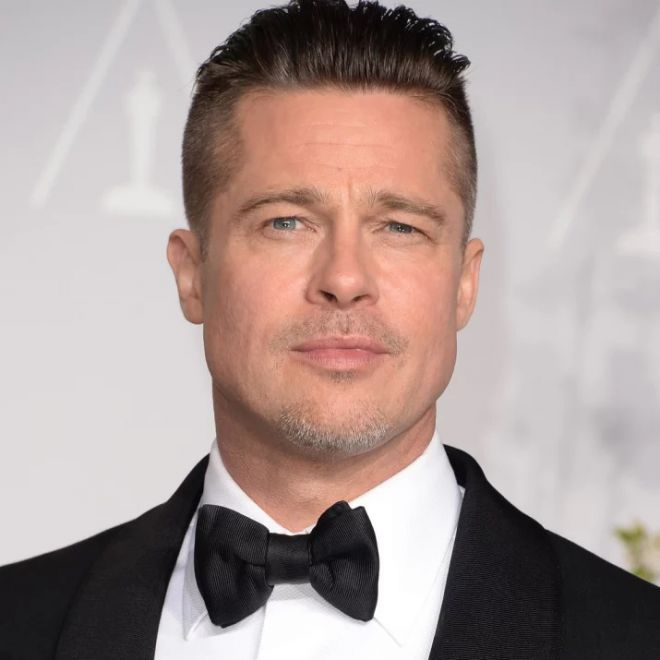

# Emotion & beauty estimation
Build and run [**EmotionAndBeautyEstimation.csproj**](EmotionAndBeautyEstimation) to classify face emotion and estimate face beauty. 
```batch
Image: [CF600.jpg] --> detected [1] faces
        [Face #1]: --> classified as [happiness] emotion and [8,3/10.0] beauty
Image: [CF601.jpg] --> detected [1] faces
        [Face #1]: --> classified as [happiness] emotion and [6,6/10.0] beauty
Image: [CF602.jpg] --> detected [1] faces
        [Face #1]: --> classified as [neutral] emotion and [8,2/10.0] beauty
Image: [CF603.jpg] --> detected [1] faces
        [Face #1]: --> classified as [happiness] emotion and [7,8/10.0] beauty
Image: [CF604.jpg] --> detected [1] faces
        [Face #1]: --> classified as [neutral] emotion and [7,1/10.0] beauty
Image: [CM722.jpg] --> detected [1] faces
        [Face #1]: --> classified as [neutral] emotion and [8,8/10.0] beauty
Image: [CM726.jpg] --> detected [1] faces
        [Face #1]: --> classified as [neutral] emotion and [6,3/10.0] beauty
Image: [CM739.jpg] --> detected [1] faces
        [Face #1]: --> classified as [happiness] emotion and [7,6/10.0] beauty
Image: [CM742.jpg] --> detected [1] faces
        [Face #1]: --> classified as [neutral] emotion and [8,2/10.0] beauty
Image: [CM750.jpg] --> detected [1] faces
        [Face #1]: --> classified as [neutral] emotion and [6,1/10.0] beauty
```
<p align="center"></p>
<p align="center"><b>Figure 1.</b> Results for Scarlett Johansson and Callan McAuliffe photos.jpg</p>  


# Face detection
Build and run [**FaceDetection.csproj**](FaceDetection) to produce face detection results.
```batch
Image: [oscar.jpg] --> detected [13] faces
Image: [oscar2.jpg] --> detected [4] faces
Image: [selfie.jpg] --> detected [5] faces
Image: [selfie2.jpg] --> detected [18] faces
```

<p align="center"></p>
<p align="center"><b>Figure 2.</b> Results for oscar2.jpg</p>  

# Face embeddings classification
Build and run [**FaceEmbeddingsClassification.csproj**](FaceEmbeddingsClassification) to classify 9 faces as Brad Pitt, Nicole Kidman or Sarah Paulson.
```batch
Image: [brad_1.jpg] --> classified as [Brad Pitt] with similarity [0,96517545]
Image: [brad_2.jpg] --> classified as [Brad Pitt] with similarity [0,8623285]
Image: [brad_3.jpg] --> classified as [Brad Pitt] with similarity [0,8151555]
Image: [nicole_1.jpg] --> classified as [Nicole Kidman] with similarity [0,8584538]
Image: [nicole_2.jpg] --> classified as [Nicole Kidman] with similarity [0,8298364]
Image: [nicole_3.jpg] --> classified as [Nicole Kidman] with similarity [0,8977611]
Image: [sarah_1.jpg] --> classified as [Sarah Paulson] with similarity [0,9042954]
Image: [sarah_2.jpg] --> classified as [Sarah Paulson] with similarity [0,8464778]
Image: [sarah_3.jpg] --> classified as [Sarah Paulson] with similarity [0,84192747]
```

# Face landmarks extraction
Build and run [**FaceLandmarksExtraction.csproj**](FaceLandmarksExtraction) to produce face landmarks for 3 images.
```batch
Image: [bruce.jpg] --> detected [1] faces
Image: [jake.jpg] --> detected [1] faces
Image: [kid.jpg] --> detected [1] faces
```
<p align="center"></p>
<p align="center"><b>Figure 3.</b> Results for kid.jpg</p>  

# Face semantic segmentation
Build and run [**FaceSemanticSegmentation.csproj**](FaceSemanticSegmentation) to produce face segmentation maps for 3 images.
```batch
Image: [brad.jpg] --> detected [1] faces
Image: [michael.jpg] --> detected [1] faces
Image: [nicole.jpg] --> detected [1] faces
```
<p align="center"></p>
<p align="center"><b>Figure 4.</b> Original image brad.jpg and face segmentation map</p>  
