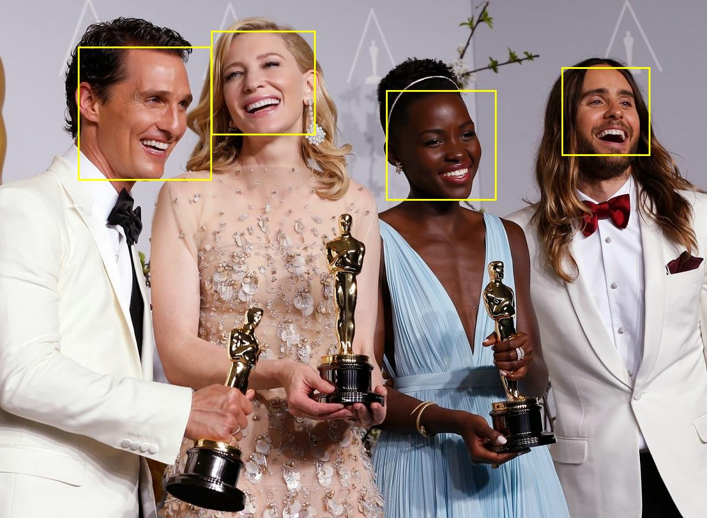
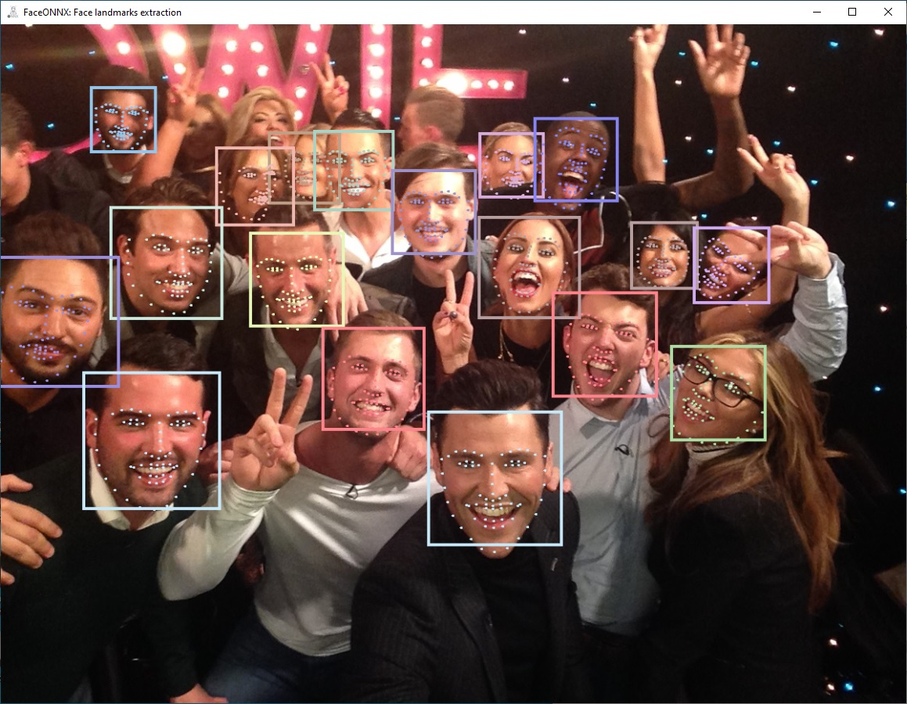

<p align="center"></p>

Face analytics library based on deep neural networks and [**ONNX**](https://onnx.ai/) runtime.  
# About
**FaceONNX** is a face analytics library for [**.NET platform**](https://dotnet.microsoft.com/). It containts ready-made deep neural networks for face
* detection and landmarks extraction,
* gender and race classification,
* age and emotions classification,
* beauty prediction,
* embeddings comparison and etc.  

# How to Use
Use nuget package manager to add [**FaceONNX**](https://www.nuget.org/packages/FaceONNX/) to your project
```
PM> Install-Package FaceONNX -Version 1.0.0.3
```

To get started with the **FaceONNX**, it is recommended to look at the repository with [**examples**](FaceONNX.Examples).  

<p align="center"></p>
<p align="center"><b>Figure 2.</b> Face detection</p>  

<p align="center"></p>
<p align="center"><b>Figure 2.</b> Face landmarks extraction</p>  

# License
**MIT**
