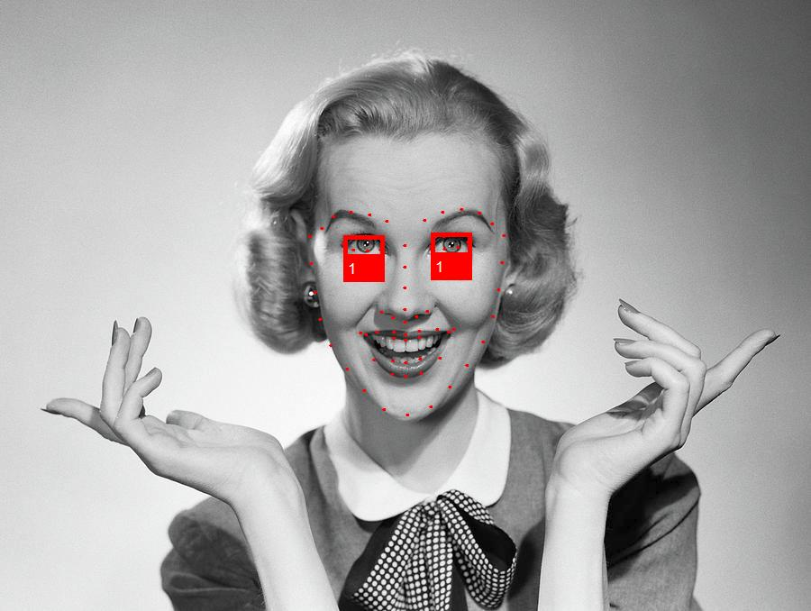

<p align="center"></p>
<p align="center"> Face analytics library based on deep neural networks and <b>ONNX</b> runtime </p>  

# Face detection
Build and run [FaceDetection.csproj](FaceDetection) to produce face detection results.
```
Image: [oscar.jpg] --> detected [13] faces
Image: [oscar2.jpg] --> detected [4] faces
Image: [selfie.jpg] --> detected [5] faces
Image: [selfie2.jpg] --> detected [18] faces
```

<p align="center"></p>
<p align="center"><b>Figure 1.</b> Results for <i>oscar2.jpg</i></p>  

# Face landmarks extraction
Build and run [FaceLandmarksExtraction.csproj](FaceLandmarksExtraction) to produce faces landmarks.
```
Image: [bruce.jpg] --> detected [1] faces
Image: [jake.jpg] --> detected [1] faces
Image: [kid.jpg] --> detected [1] faces
```
<p align="center"></p>
<p align="center"><b>Figure 2.</b> Results for <i>kid.jpg</i></p>  

# Face embeddings classification
Build and run [FaceEmbeddingsClassification.csproj](FaceEmbeddingsClassification) to classify faces as "Brad Pitt", "Nicole Kidman" or "Sarah Paulson".
```
Image: [brad_1.jpg] --> classified as [Brad Pitt] with similarity [0,96517545]
Image: [brad_2.jpg] --> classified as [Brad Pitt] with similarity [0,8623285]
Image: [brad_3.jpg] --> classified as [Brad Pitt] with similarity [0,8151555]
Image: [nicole_1.jpg] --> classified as [Nicole Kidman] with similarity [0,8584538]
Image: [nicole_2.jpg] --> classified as [Nicole Kidman] with similarity [0,8298364]
Image: [nicole_3.jpg] --> classified as [Nicole Kidman] with similarity [0,8977611]
Image: [sarah_1.jpg] --> classified as [Sarah Paulson] with similarity [0,9042954]
Image: [sarah_2.jpg] --> classified as [Sarah Paulson] with similarity [0,8464778]
Image: [sarah_3.jpg] --> classified as [Sarah Paulson] with similarity [0,84192747]
```

# Antispoofing depth classification
Build and run [AntispoofingDepthClassification.csproj](AntispoofingDepthClassification) to classify face depth as "Fake" or "Real".
```
Image: [fake_1.jpeg] --> classified as [Fake] with probability [0.9840763]
Image: [fake_10.jpeg] --> classified as [Fake] with probability [0.9999999]
Image: [fake_2.jpeg] --> classified as [Fake] with probability [1]
Image: [fake_3.jpeg] --> classified as [Fake] with probability [1]
Image: [fake_4.jpeg] --> classified as [Fake] with probability [1]
Image: [fake_5.jpeg] --> classified as [Fake] with probability [0.99999964]
Image: [fake_6.jpeg] --> classified as [Fake] with probability [0.99999976]
Image: [fake_7.jpeg] --> classified as [Fake] with probability [1]
Image: [fake_8.jpeg] --> classified as [Fake] with probability [1]
Image: [fake_9.jpeg] --> classified as [Fake] with probability [0.99999714]
Image: [real_1.jpeg] --> classified as [Real] with probability [0.99999976]
Image: [real_10.jpeg] --> classified as [Real] with probability [0.9999999]
Image: [real_2.jpeg] --> classified as [Real] with probability [0.9999927]
Image: [real_3.jpeg] --> classified as [Real] with probability [0.9999993]
Image: [real_4.jpeg] --> classified as [Real] with probability [0.9999974]
Image: [real_5.jpeg] --> classified as [Real] with probability [0.9999989]
Image: [real_6.jpeg] --> classified as [Real] with probability [1]
Image: [real_7.jpeg] --> classified as [Real] with probability [0.9997955]
Image: [real_8.jpeg] --> classified as [Real] with probability [0.9999813]
Image: [real_9.jpeg] --> classified as [Real] with probability [1]
```

# Eye blink detection
Build and run [EyeBlinkDetection.csproj](EyeBlinkDetection) to detect eye blink.
```
Image: [closed_closed.jpg] --> detected [1] faces
Image: [closed_open.jpg] --> detected [1] faces
Image: [open_open.jpg] --> detected [1] faces
```

<p align="center"></p>
<p align="center"><b>Figure 3.</b> Results for <i>open_open.jpg</i></p> 

# Gender classification
Build and run [GenderClassification.csproj](GenderClassification) to classify faces as "Male" or "Female".
```
Image: [CF600.jpg] --> detected [1] faces
        [Face #1]: --> classified as [Female] gender with probability [1]
Image: [CF601.jpg] --> detected [1] faces
        [Face #1]: --> classified as [Female] gender with probability [1]
Image: [CF602.jpg] --> detected [1] faces
        [Face #1]: --> classified as [Female] gender with probability [1]
Image: [CF603.jpg] --> detected [1] faces
        [Face #1]: --> classified as [Female] gender with probability [0,99999154]
Image: [CF604.jpg] --> detected [1] faces
        [Face #1]: --> classified as [Female] gender with probability [0,9968484]
Image: [CM722.jpg] --> detected [1] faces
        [Face #1]: --> classified as [Male] gender with probability [1]
Image: [CM725.jpg] --> detected [1] faces
        [Face #1]: --> classified as [Male] gender with probability [1]
Image: [CM726.jpg] --> detected [1] faces
        [Face #1]: --> classified as [Male] gender with probability [0,9999999]
Image: [CM739.jpg] --> detected [1] faces
        [Face #1]: --> classified as [Male] gender with probability [1]
Image: [CM742.jpg] --> detected [1] faces
        [Face #1]: --> classified as [Male] gender with probability [1]
```

# Emotion & beauty estimation
Build and run [EmotionAndBeautyEstimation.csproj](EmotionAndBeautyEstimation) to classify face emotion and estimate face beauty. 
```
Image: [CF600.jpg] --> detected [1] faces
        [Face #1]: --> classified as [happiness] emotion and [8,3/10.0] beauty
Image: [CF601.jpg] --> detected [1] faces
        [Face #1]: --> classified as [happiness] emotion and [6,6/10.0] beauty
Image: [CF602.jpg] --> detected [1] faces
        [Face #1]: --> classified as [neutral] emotion and [8,2/10.0] beauty
Image: [CF603.jpg] --> detected [1] faces
        [Face #1]: --> classified as [happiness] emotion and [7,9/10.0] beauty
Image: [CF604.jpg] --> detected [1] faces
        [Face #1]: --> classified as [neutral] emotion and [7,3/10.0] beauty
Image: [CM722.jpg] --> detected [1] faces
        [Face #1]: --> classified as [neutral] emotion and [8,9/10.0] beauty
Image: [CM725.jpg] --> detected [1] faces
        [Face #1]: --> classified as [neutral] emotion and [5,8/10.0] beauty
Image: [CM726.jpg] --> detected [1] faces
        [Face #1]: --> classified as [neutral] emotion and [6,3/10.0] beauty
Image: [CM739.jpg] --> detected [1] faces
        [Face #1]: --> classified as [happiness] emotion and [7,5/10.0] beauty
Image: [CM742.jpg] --> detected [1] faces
        [Face #1]: --> classified as [neutral] emotion and [8/10.0] beauty
```

# GPU Perfomance tests
Build and run [GPUPerfomanceTests.csproj](GPUPerfomanceTests) to test FaceONNX inference on GPU.  
GPU Perfomance tests with CUDA 11.0.2 and cuDNN 8.0.4.30 (Windows 10) on NVIDIA GeForce GTX 1050 Ti (GPU) and Intel Core i7 9700K (CPU).
```
FaceONNX: GPU Perfomance tests with CUDA provider

Configuring FaceRecognitionTest
Configuring GPU device
Finished in [1093] ms
Running test for [100] iterations
Average time --> [18,43] ms
FPS --> [54,259357]
Finished in [1843] ms

Configuring FaceRecognitionTest
Configuring CPU device
Finished in [391] ms
Running test for [100] iterations
Average time --> [127,5] ms
FPS --> [7,8431373]
Finished in [12750] ms
```
